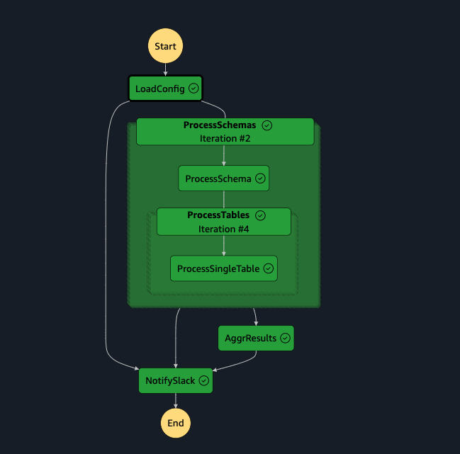

# 🚀 Parallel Processing with AWS Step Functions Map State

This guide explains how to easily build parallel processing using the Map state in AWS Step Functions. This repository uses AWS CDK to build a sample architecture that includes the Map state.

---

## 🎯 Project Overview

`aws-map-state` is a sample project that uses the Map state in AWS Step Functions to achieve the following:

- Efficient task processing using parallel execution
- Modular tasks utilizing AWS Lambda
- Infrastructure as code management using AWS CDK

---

## 🗂️ Project Tree

```bash
aws-map-state/
├── bin/                # Entry point for the CDK application
├── cdk.json            # CDK configuration file
├── docs/               # Documentation
├── jest.config.js      # Jest configuration file
├── lambdas/            # Code for AWS Lambda functions
│   └── tests/
│       ├── fixtures/
│       └── ...
├── layers/             # Lambda layers
│   ├── requirements.txt
│   ├── Dockerfile
│   └── layer.sh
├── lib/                # Definitions for CDK stacks
│   ├── aws-map-state-stack.ts
│   ├── lambda.ts
│   └── state-machine.ts
├── package.json
├── README.md
├── scripts/            # Utility scripts
│   ├── deploy.sh
│   └── destroy.sh
├── stepfunctions/      # Definition files for Step Functions
│   └── workflow.yaml
├── test/
│   └── aws-map-state.test.ts
└── tsconfig.json
```

## WORKFLOW



## Useful commands

```bash
# deploy
$ npx cdk deploy -c env={env}

# destroy
$ npx cdk destroy -c env={env}
```

## Scripts

The `script/` folder contains utility scripts for managing the project.

### Deploy Script

```bash
# deploy using the script
$ ./script/deploy.sh {env}

# destory using the script
$ ./script/destroy.sh {env}
```

## Test 

T.B.D.
